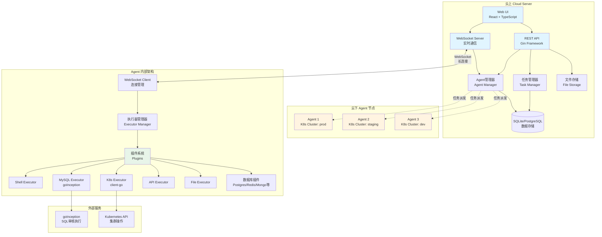
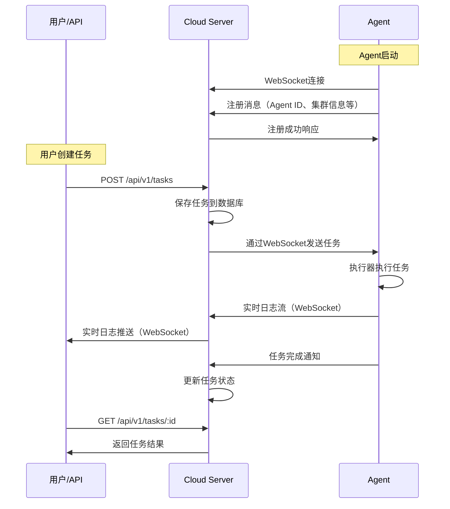

# Tiangong Deploy

> 一个开源的混合云软件部署与远程管控平台，对标 Palantir Apollo

**Tiangong Deploy** 是一个开源的混合云软件部署与远程管控平台，让开发者一次编写代码，即可安全、合规地部署到任何环境（公有云、私有云、混合云、边缘节点），无需关心基础设施的复杂性和环境差异。

> 参考：[Palantir Apollo](https://www.palantir.com/docs/apollo/core/introduction/) - 一个可扩展、可扩展的平台，用于管理和部署软件，编码了操作最佳实践

---

## 🎯 核心目标

### Write Once, Deploy Anywhere（一次编写，随处部署）

开发者只需编写一次代码，无需关心如何到达所有环境。Tiangong Deploy 自动处理不同环境的配置差异、网络限制、安全策略等复杂性，让开发者专注于业务逻辑创新。

### 统一的多环境管理

无论环境位置或连接状态如何，都能统一管理。支持：
- **连接环境**：公有云、私有云、混合云
- **断开连接环境**：Air-gapped、边缘节点
- **混合环境**：跨地域、跨云的多环境组合

### 合规感知的变更管理

内置变更审批流程，防止未授权变更。完整的审计跟踪，满足合规要求（如等保、ISO 27001等）。支持维护窗口、变更抑制等合规控制。

---

## 👥 解决不同角色的核心问题

### 👨‍💻 开发者（Developers）

**核心痛点**：
- **环境碎片化**：需要为不同环境编写不同的部署脚本，维护成本高
- **部署复杂性**：需要了解每个环境的特殊要求（K8s版本、网络策略等）
- **发布流程繁琐**：需要手动选择目标环境，缺乏自动化推广机制
- **缺乏约束管理**：无法定义跨服务依赖、数据库版本要求等约束

**Tiangong Deploy 解决方案**：
- ✅ **统一部署模型**：所有环境使用相同的部署接口，自动适配环境差异
- ✅ **发布渠道机制**：定义 RELEASE → CANARY → STABLE 等渠道，环境自动订阅
- ✅ **约束引擎**：开发者定义产品约束，环境定义环境约束，系统自动协调
- ✅ **一次编写**：开发者只需关注代码，部署由平台自动处理

---

### 👨‍💼 环境操作者 / 运维人员（Environment Operators）

**核心痛点**：
- **多环境管理困难**：需要管理多个环境，每个环境可能有不同的工具和流程
- **变更风险控制**：缺乏统一的变更审批流程，变更历史难以追溯
- **部署操作复杂**：需要手动执行 SQL、K8s 部署、文件分发等操作
- **合规要求**：需要满足等保、ISO 27001 等合规要求

**Tiangong Deploy 解决方案**：
- ✅ **统一控制面板**：一个界面管理所有环境，实时查看部署状态
- ✅ **变更管理**：定义审批流程、维护窗口、变更抑制规则
- ✅ **零代码操作**：通过 Web UI 或 CLI 完成所有操作，无需编写脚本
- ✅ **完整审计**：所有变更自动记录，支持审计和追溯
- ✅ **环境订阅**：环境订阅合适的发布渠道，自动接收符合条件的发布

### 🔧 SRE/DevOps 工程师

**核心痛点**：
- **工具集成复杂**：需要集成 Ansible、Kubectl、数据库客户端等多种工具
- **跨环境自动化困难**：不同环境的网络、认证、权限差异导致自动化脚本复杂
- **可观测性不足**：部署过程缺乏实时可见性，问题定位困难
- **扩展性限制**：现有工具难以扩展新的执行器类型

**Tiangong Deploy 解决方案**：
- ✅ **插件化架构**：统一的 Executor 接口，易于扩展新的执行器类型
- ✅ **统一执行模型**：所有操作都通过任务系统，支持 API 调用和自动化集成
- ✅ **实时可观测性**：WebSocket 实时日志流，支持与 Prometheus、DataDog 等监控工具集成
- ✅ **灵活扩展**：支持自定义执行器、工作流、约束条件

---

### 🔒 安全与合规团队（Security & Compliance）

**核心痛点**：
- **变更控制不足**：无法防止未授权的变更，缺乏变更审批流程
- **审计困难**：变更记录分散，缺乏统一的审计日志
- **安全策略执行**：无法统一执行安全策略，缺乏环境隔离和权限控制

**Tiangong Deploy 解决方案**：
- ✅ **变更审批**：集成身份提供商（SAML），定义审批流程和授权审批人
- ✅ **完整审计**：所有变更自动记录，支持审计查询和报告
- ✅ **权限控制**：基于角色的访问控制（RBAC），支持环境级别的权限隔离
- ✅ **合规框架**：内置合规控制机制，支持等保、ISO 27001 等要求

---

## 🏗️ 系统架构

### 整体架构图



### 核心组件说明

#### Cloud Server（云上控制中心）
- **Web UI**：基于React的现代化界面，支持任务创建、文件上传、实时日志查看
- **REST API**：完整的RESTful接口，支持第三方集成
- **WebSocket Server**：与Agent保持长连接，实现实时双向通信
- **任务管理器**：任务创建、派发、状态跟踪、日志收集
- **Agent管理器**：Agent注册、心跳监控、连接管理
- **文件存储**：文件上传、存储、分发管理

#### Agent（云下执行节点）
- **WebSocket Client**：自动连接到Cloud，维持长连接和心跳
- **执行器管理器**：统一的任务执行框架，支持插件化扩展
- **插件系统**：
  - **Shell Executor**：执行Shell命令
  - **MySQL Executor**：通过goInception执行SQL，支持审核、备份、回滚
  - **K8s Executor**：使用client-go SDK操作Kubernetes集群
  - **API Executor**：执行HTTP/HTTPS请求
  - **File Executor**：文件复制、删除、创建等操作
  - **数据库插件**：PostgreSQL、Redis、MongoDB、Elasticsearch、ClickHouse、Doris等

### 通信流程



---

## ✨ 核心特性

### 🚀 Write Once, Deploy Anywhere
- 开发者只需编写一次代码，无需关心如何到达所有环境
- 自动处理不同环境的配置差异、网络限制、安全策略
- 支持公有云、私有云、混合云、边缘节点、Air-gapped 环境

### 📦 统一的多环境管理
- 单一控制面板管理所有环境，无论位置或连接状态
- 支持连接环境、断开连接环境（air-gapped）、混合环境
- 实时查看所有环境的部署状态和健康情况

### 🔄 发布渠道机制（Release Channels）
- 定义发布渠道（如 RELEASE、CANARY、STABLE）
- 环境订阅合适的发布渠道，自动接收符合条件的发布
- 自动推广机制：满足条件后自动推广到下一个渠道

### 🛡️ 合规感知的变更管理
- 内置变更审批流程，防止未授权变更
- 完整的审计跟踪，满足合规要求（等保、ISO 27001等）
- 支持维护窗口、变更抑制等合规控制
- 基于角色的访问控制（RBAC）

### 🧩 插件式扩展架构
- 统一的 Executor 接口，易于开发自定义执行器
- 支持 Shell、SQL、K8s、API、文件操作等多种执行器
- 通过 YAML 配置文件动态加载插件
- 支持多数据库类型（MySQL、PostgreSQL、Redis、MongoDB等）

### ☸️ Kubernetes 原生支持
- 使用 `client-go` SDK 直接操作 Kubernetes
- 支持 in-cluster 配置（在Pod中自动使用）
- 支持 kubeconfig 文件配置（集群外运行）
- Agent自动上报所在K8s集群名称，便于多集群管理

### 👀 实时可观测性
- WebSocket 实时日志流式传输
- 任务状态实时更新（pending → running → success/failed）
- 支持与 Prometheus、DataDog 等监控工具集成
- 完整的操作历史记录和日志回放

### 🔍 SQL 审核与执行
- 集成 [goInception](https://github.com/hanchuanchuan/goInception)，提供SQL审核功能
- 支持SQL执行、自动备份、生成回滚语句
- 支持MySQL、PostgreSQL等多种数据库

### 📊 约束引擎（规划中）
- 开发者定义产品约束（依赖、版本要求等）
- 环境定义环境约束（维护窗口、变更限制等）
- 系统自动协调约束，确保安全部署

---

## 🚀 快速开始

### 前置要求

- **Go 1.21+**
- **goInception 服务**（SQL执行器需要）
  ```bash
  # 下载并启动 goInception
  docker pull hanchuanchuan/goinception
  docker run -d -p 4000:4000 hanchuanchuan/goinception
  ```

### 方式一：Docker Compose（推荐）

```bash
# 克隆项目
git clone <repository-url>
cd tiangong-deploy

# 启动服务
docker-compose -f deployments/docker-compose.yml up -d

# 查看日志
docker-compose -f deployments/docker-compose.yml logs -f
```

### 方式二：手动部署

#### 1. 启动 Cloud 服务

```bash
go run cmd/cloud/main.go -addr :8080 -db ./data/cloud.db -storage ./data/files
```

#### 2. 启动 Agent

```bash
# 设置 K8s 集群名称（可选）
export K8S_CLUSTER_NAME=production

# 启动 Agent
go run cmd/agent/main.go -cloud http://localhost:8080 -name my-agent
```

#### 3. 访问 Web UI

打开浏览器访问：http://localhost:8080

### 方式三：Kubernetes 部署

```bash
# 使用 Helm Chart 部署
helm install tiangong-deploy ./deployments/helm/tiangong-deploy
```

---

## 📖 使用指南

### Web UI 使用

1. **Agent 管理**：查看所有已注册的Agent节点，包括状态、集群信息等
2. **任务创建**：选择Agent、任务类型（Shell/SQL/K8s等），输入命令或上传文件
3. **实时日志**：任务执行过程中实时查看日志输出
4. **文件管理**：上传文件，一键分发到多个Agent节点
5. **历史记录**：查看所有历史任务，支持日志回放

### CLI 工具使用

```bash
# 构建 CLI 工具
go build -o cloudctl cmd/cli/main.go

# 执行 Shell 命令
./cloudctl run -type shell -command "ls -la" -agent <agent-id>

# 执行 SQL
./cloudctl run -type mysql -file demo.sql -agent <agent-id> -params '{"connection":"default"}'

# 上传文件
./cloudctl upload -file demo.zip

# 分发文件到Agent
./cloudctl distribute -file <file-id> -agents <agent-id1>,<agent-id2>

# 查看任务列表
./cloudctl list -resource tasks

# 查看任务日志
./cloudctl logs -task <task-id>
```

### API 调用示例

```bash
# 创建任务
curl -X POST http://localhost:8080/api/v1/tasks \
  -H "Content-Type: application/json" \
  -d '{
    "agent_id": "agent-123",
    "type": "shell",
    "command": "ls -la /tmp"
  }'

# 查询任务
curl http://localhost:8080/api/v1/tasks/<task-id>

# 上传文件
curl -X POST http://localhost:8080/api/v1/files \
  -F "file=@demo.zip"
```

---

## ⚙️ 配置说明

### Agent 插件配置

编辑 `configs/agent-plugins.yaml` 来配置执行器插件：

```yaml
plugins:
  # Shell 命令执行器
  - type: shell
    enabled: true
    config:
      timeout: 1800  # 超时时间（秒）

  # MySQL 执行器（使用 goInception）
  - type: mysql
    enabled: true
    config:
      goinception_url: http://localhost:4000
      connections:
        - name: default
          database: test

  # PostgreSQL 执行器
  - type: postgres
    enabled: true
    config:
      connections:
        - name: default
          host: localhost
          port: 5432
          database: test
          username: postgres

  # Kubernetes 执行器
  - type: k8s
    enabled: true
    config:
      kubeconfig: ~/.kube/config  # 可选，Pod中自动使用in-cluster配置
      namespace: default

  # HTTP API 执行器
  - type: api
    enabled: true
    config:
      timeout: 30
      verify_ssl: true

  # 文件操作执行器
  - type: file
    enabled: true
    config:
      base_path: /tmp/tiangong-deploy
```

**配置说明**：

1. **数据库执行器**：
   - **MySQL**：使用 goInception 提供SQL审核、执行、备份和回滚功能
   - **PostgreSQL/Redis/MongoDB**：直接连接数据库执行
   - 支持通过配置文件为每种数据库类型配置多个连接

2. **K8s 执行器**：
   - 在 Kubernetes Pod 中运行时自动使用 in-cluster 配置
   - 在集群外运行时使用 kubeconfig 文件
   - 支持 apply YAML、get、list、delete、describe 等操作

---

## 📚 API 文档

### Agent API

- `GET /api/v1/agents` - 列出所有Agent
- `GET /api/v1/agents/:id` - 获取Agent信息
- `GET /api/v1/agents/:id/status` - 获取Agent状态

### Task API

- `POST /api/v1/tasks` - 创建任务
- `GET /api/v1/tasks` - 列出任务
- `GET /api/v1/tasks/:id` - 获取任务信息
- `GET /api/v1/tasks/:id/logs` - 获取任务日志
- `POST /api/v1/tasks/:id/cancel` - 取消任务

### File API

- `POST /api/v1/files` - 上传文件
- `GET /api/v1/files` - 列出文件
- `GET /api/v1/files/:id` - 获取文件信息
- `GET /api/v1/files/:id/download` - 下载文件
- `POST /api/v1/files/:id/distribute` - 分发文件到Agent

### WebSocket

- `WS /ws` - WebSocket连接，用于Agent注册和实时日志传输

详细的API文档请参考：[API接口文档](./docs/0-cloud-API接口文档.md)

---

## 🛠️ 开发指南

### 项目结构

```
tiangong-deploy/
├── cmd/
│   ├── cloud/          # Cloud 服务入口
│   ├── agent/          # Agent 服务入口
│   └── cli/            # CLI 工具
├── internal/
│   ├── cloud/          # Cloud 服务核心代码
│   │   ├── server/     # HTTP/WebSocket 服务器
│   │   ├── task/       # 任务管理
│   │   ├── agent/      # Agent 连接管理
│   │   └── storage/    # 数据存储层
│   ├── agent/          # Agent 核心代码
│   │   ├── client/     # Cloud 连接客户端
│   │   ├── executor/   # 执行器框架
│   │   └── plugins/    # 插件实现
│   └── common/         # 共享代码（协议、模型等）
├── ui/                 # React 前端
│   ├── src/
│   │   ├── components/ # UI 组件
│   │   ├── pages/      # 页面
│   │   └── services/   # API 服务
├── configs/            # 配置文件示例
├── deployments/        # Docker/Helm 部署文件
└── docs/              # 文档
```

### 构建

```bash
# 构建 Cloud
go build -o bin/cloud ./cmd/cloud

# 构建 Agent
go build -o bin/agent ./cmd/agent

# 构建 CLI
go build -o bin/cloudctl ./cmd/cli

# 构建 UI
cd ui && npm install && npm run build
```

### 开发自定义执行器

实现 `plugins.Executor` 接口：

```go
type Executor interface {
    Type() common.TaskType
    Execute(taskID string, command string, params map[string]interface{}, 
            fileID string, logCallback LogCallback) (string, error)
}
```

在 `configs/agent-plugins.yaml` 中注册：

```yaml
plugins:
  - type: custom
    enabled: true
    config:
      # 自定义配置
```

---

## 🎯 典型使用场景

### 场景1：跨地域应用发布

1. 上传发布包（包含SQL、YAML、脚本）
2. 选择多个环境的Agent节点
3. 依次执行：SQL更新 → K8s部署 → 健康检查
4. 实时查看每个节点的执行日志
5. 失败节点可单独重试

### 场景2：数据库批量操作

1. 上传SQL脚本文件
2. 选择目标数据库连接
3. 通过goInception审核SQL
4. 执行SQL并自动备份
5. 如需回滚，使用生成的回滚SQL

### 场景3：Kubernetes多集群管理

1. 在不同K8s集群部署Agent
2. Agent自动上报集群名称
3. 在Web UI中按集群筛选Agent
4. 统一执行K8s操作（apply、get、delete等）
5. 实时查看Pod日志和状态

---

## 🔒 安全建议

- **生产环境**：
  - 启用HTTPS/WSS加密通信
  - 配置Agent认证（Token或mTLS）
  - 限制WebSocket来源（CheckOrigin）
  - 使用PostgreSQL替代SQLite
  - 配置数据库连接白名单

- **权限控制**：
  - Agent执行器配置最小权限
  - K8s执行器使用ServiceAccount限制权限
  - 文件操作限制在指定目录

---

## 📄 许可证

MIT License

---

## 🤝 贡献

欢迎提交Issue和Pull Request！

---

## 📞 联系方式

- **项目地址**：https://github.com/comqx/tiangong-deploy
- **问题反馈**：https://github.com/comqx/tiangong-deploy/issues

---

## 📚 相关文档

- [核心目标与角色痛点分析](./docs/3-核心目标与角色痛点分析.md) - 详细分析各角色的痛点和解决方案
- [API 接口文档](./docs/0-cloud-API接口文档.md) - 完整的 API 接口说明
- [项目需求和功能要求](./docs/1-项目需求和功能要求.md) - 项目需求文档

## 🔗 参考

- [Palantir Apollo](https://www.palantir.com/docs/apollo/core/introduction/) - Tiangong Deploy 对标的商业产品

---

**Tiangong Deploy** - 一次编写，随处部署。让开发者专注于创新，而不是基础设施的复杂性 🚀
