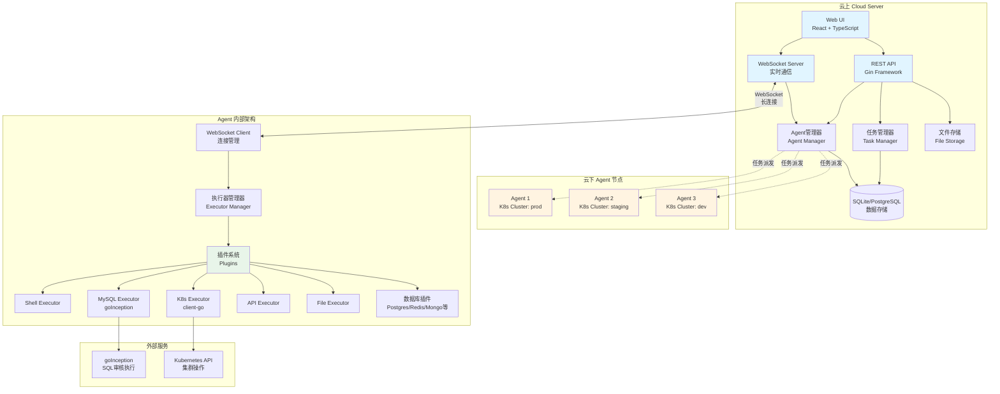
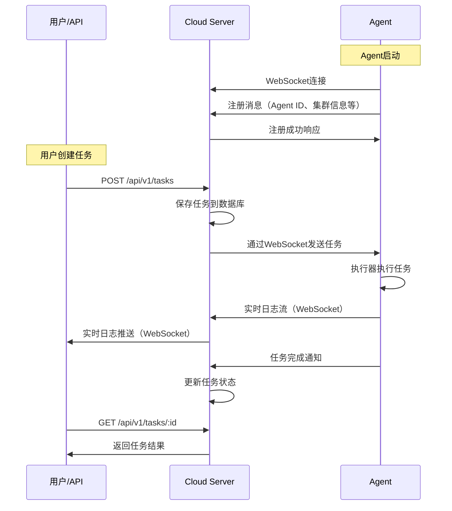

# Cloud Agent

> 一个面向运维的低门槛混合云远程管控开源项目

**Cloud Agent** 是一个开箱即用的混合云远程执行与发布系统，支持文件分发、SQL执行、命令执行、Kubernetes部署和实时日志回传，零开发成本，面向运维人员，像用FTP一样简单。

---

## 🎯 项目价值：解决不同角色的核心问题

### 👨‍💼 传统运维人员
**痛点**：
- 需要在多个服务器上执行SQL、部署应用、查看日志
- 不熟悉开发，无法编写自动化脚本
- 跨地域、跨环境操作复杂，容易出错

**解决方案**：
- ✅ 零代码操作：通过Web界面或CLI，点几下就能完成所有操作
- ✅ 统一入口：一个平台管理所有Agent节点，无需记忆多套工具
- ✅ 实时反馈：执行过程实时显示日志，失败可立即重试
- ✅ 文件分发：上传一次文件，自动分发到多个节点

### 🔧 SRE/DevOps 工程师
**痛点**：
- 需要集成多种工具（Ansible、Kubectl、数据库客户端等）
- 跨云、跨地域的统一管控困难
- 缺乏统一的审计和日志追溯

**解决方案**：
- ✅ 统一执行模型：所有操作都通过任务系统，支持API调用和自动化集成
- ✅ 插件化架构：SQL、K8s、Shell、API调用都作为插件，易于扩展
- ✅ 完整审计：所有操作记录可追溯，支持历史回放
- ✅ 多集群管理：Agent自动上报集群信息，支持多K8s集群统一管理

### 👨‍💻 研发团队
**痛点**：
- 需要将远程执行能力集成到现有平台
- 需要支持自定义执行器和工作流
- 需要Webhook和API集成能力

**解决方案**：
- ✅ RESTful API：完整的API接口，支持深度集成
- ✅ 插件开发：统一的Executor接口，易于开发自定义执行器
- ✅ WebSocket支持：实时日志流式传输，支持自定义消息协议
- ✅ CLI工具：支持脚本化和CI/CD集成

### 🔐 安全与合规团队
**痛点**：
- 无法限制危险命令执行（rm -rf /, shutdown 等）
- 缺乏完整的操作审计和追溯
- 权限控制粒度不够，难以满足合规要求
- 担心 Agent 权限过大带来安全风险

**解决方案**：
- ✅ 命令白名单：基于正则表达式，只允许安全命令执行
- ✅ 命令黑名单：自动阻止危险操作和命令注入
- ✅ 审计日志：JSON 格式记录所有命令尝试、执行结果和耗时
- ✅ RBAC 权限：Kubernetes 细粒度权限控制
- ✅ 可配置安全级别：开发/生产环境使用不同的安全策略

### 🏗️ 平台与基础设施团队
**痛点**：
- Docker 镜像构建重复，CI/CD 流程慢
- 服务耦合，难以独立扩展和部署
- 缺乏标准化的部署方式

**解决方案**：
- ✅ 分离构建：UI、Cloud、Agent 独立 Docker 镜像，避免重复编译
- ✅ 微服务架构：服务独立部署、扩展和升级
- ✅ Helm Chart：标准化 Kubernetes 部署
- ✅ 多种部署方式：Docker Compose、Kubernetes、二进制

---

## 🏗️ 系统架构

### 整体架构图



### 核心组件说明

#### Cloud Server（云上控制中心）
- **Web UI**：基于React的现代化界面，支持任务创建、文件上传、实时日志查看
- **REST API**：完整的RESTful接口，支持第三方集成
- **WebSocket Server**：与Agent保持长连接，实现实时双向通信
- **任务管理器**：任务创建、派发、状态跟踪、日志收集
- **Agent管理器**：Agent注册、心跳监控、连接管理
- **文件存储**：文件上传、存储、分发管理

#### Agent（云下执行节点）
- **WebSocket Client**：自动连接到Cloud，维持长连接和心跳
- **执行器管理器**：统一的任务执行框架，支持插件化扩展
- **插件系统**：
  - **Shell Executor**：执行Shell命令
  - **MySQL Executor**：通过goInception执行SQL，支持审核、备份、回滚
  - **K8s Executor**：使用client-go SDK操作Kubernetes集群
  - **API Executor**：执行HTTP/HTTPS请求
  - **File Executor**：文件复制、删除、创建等操作
  - **数据库插件**：PostgreSQL、Redis、MongoDB、Elasticsearch、ClickHouse、Doris等

### 通信流程



---

## ✨ 核心特性

### 🚀 零开发成本
- 只需部署 Cloud + Agent，即可在网页/CLI上完成各种操作
- 无需编写代码，上传文件、点击执行即可

### 📦 统一执行模型
- 所有操作都通过统一的任务系统：**任务创建 → Agent执行 → 实时日志返回**
- 支持文件上传、SQL执行、远程命令、API调用、Kubernetes部署等

### 🔗 长连接管理
- Agent自动注册到Cloud，维持WebSocket长连接
- 支持心跳检测，自动重连
- 每个Agent具备唯一ID，可被精确寻址执行任务

### 👀 实时可见
- 执行过程实时显示日志（WebSocket流式传输）
- 任务状态实时更新（pending → running → success/failed）
- 失败任务可立即重试

### 🧩 插件式扩展
- SQL、K8s、Shell、API调用都作为插件实现
- 统一的Executor接口，易于开发自定义执行器
- 通过YAML配置文件动态加载插件

### ☸️ K8s 原生支持
- 使用 `client-go` SDK 直接操作 Kubernetes
- 支持 in-cluster 配置（在Pod中自动使用）
- 支持 kubeconfig 文件配置（集群外运行）
- Agent自动上报所在K8s集群名称，便于多集群管理

### 🔍 SQL 审核与执行
- 集成 [goInception](https://github.com/hanchuanchuan/goInception)，提供SQL审核功能
- 支持SQL执行、自动备份、生成回滚语句
- 支持MySQL、PostgreSQL等多种数据库

### 📊 多数据库支持
- **关系型数据库**：MySQL（goInception）、PostgreSQL
- **NoSQL数据库**：Redis、MongoDB
- **分析型数据库**：Elasticsearch、ClickHouse、Doris
- 统一的数据库执行器接口，易于扩展新数据库类型

---

## 🚀 快速开始

### 前置要求

- **Go 1.21+**
- **goInception 服务**（SQL执行器需要）
  ```bash
  # 下载并启动 goInception
  docker pull hanchuanchuan/goinception
  docker run -d -p 4000:4000 hanchuanchuan/goinception
  ```

### 方式一：Docker Compose（推荐）

```bash
# 克隆项目
git clone <repository-url>
cd cloud-agent

# 启动服务
docker-compose -f deployments/docker-compose.yml up -d

# 查看日志
docker-compose -f deployments/docker-compose.yml logs -f
```

### 方式二：手动部署

#### 1. 启动 Cloud 服务

```bash
# 普通 HTTP 模式
go run cmd/cloud/main.go -addr :8080 -db ./data/cloud.db -storage ./data/files

# 启用 WSS 模式（需要先生成证书）
# 注意：如果 certs 目录不存在或证书文件缺失，请先运行证书生成脚本
chmod +x scripts/generate-cert.sh
./scripts/generate-cert.sh ./certs localhost

# 然后启动服务
go run cmd/cloud/main.go -addr :8443 \
  -cert ./certs/server.crt \
  -key ./certs/server.key \
  -db ./data/cloud.db \
  -storage ./data/files
```

#### 2. 启动 Agent

```bash
# 设置 K8s 集群名称（可选）
export K8S_CLUSTER_NAME=production

# HTTP/WS 模式
go run cmd/agent/main.go -cloud http://localhost:8080 -name my-agent
# 或者直接使用 ws:// 协议
go run cmd/agent/main.go -cloud ws://localhost:8080 -name my-agent

# WSS 模式（推荐直接使用 wss:// 协议）
go run cmd/agent/main.go -cloud wss://localhost:8443 -name my-agent
# 也支持使用 https:// 自动转换为 wss://（向后兼容）
go run cmd/agent/main.go -cloud https://localhost:8443 -name my-agent
```

#### 3. 访问 Web UI

打开浏览器访问：
- HTTP 模式：http://localhost:8080
- HTTPS 模式：https://localhost:8443（浏览器会提示自签证书警告，需要手动接受）

### 方式三：Kubernetes 部署

```bash
# 使用 Helm Chart 部署
helm install cloud-agent ./deployments/helm/cloud-agent
```

---
### 界面展示


## 📖 使用指南

### Web UI 使用

1. **Agent 管理**：查看所有已注册的Agent节点，包括状态、集群信息等
2. **任务创建**：选择Agent、任务类型（Shell/SQL/K8s等），输入命令或上传文件
3. **实时日志**：任务执行过程中实时查看日志输出
4. **文件管理**：上传文件，一键分发到多个Agent节点
5. **历史记录**：查看所有历史任务，支持日志回放

### CLI 工具使用

```bash
# 构建 CLI 工具
go build -o cloudctl cmd/cli/main.go

# 执行 Shell 命令
./cloudctl run -type shell -command "ls -la" -agent <agent-id>

# 执行 SQL
./cloudctl run -type mysql -file demo.sql -agent <agent-id> -params '{"connection":"default"}'

# 上传文件
./cloudctl upload -file demo.zip

# 分发文件到Agent
./cloudctl distribute -file <file-id> -agents <agent-id1>,<agent-id2>

# 查看任务列表
./cloudctl list -resource tasks

# 查看任务日志
./cloudctl logs -task <task-id>
```

### API 调用示例

```bash
# 创建任务
curl -X POST http://localhost:8080/api/v1/tasks \
  -H "Content-Type: application/json" \
  -d '{
    "agent_id": "agent-123",
    "type": "shell",
    "command": "ls -la /tmp"
  }'

# 查询任务
curl http://localhost:8080/api/v1/tasks/<task-id>

# 上传文件
curl -X POST http://localhost:8080/api/v1/files \
  -F "file=@demo.zip"
```

---

## ⚙️ 配置说明

### WSS 安全通信配置

项目支持使用 WSS（WebSocket Secure）协议进行加密通信，保证数据传输安全。

#### 快速配置

1. **生成自签证书**：
```bash
chmod +x scripts/generate-cert.sh

# 基本用法：生成单个域名证书
./scripts/generate-cert.sh ./certs localhost

# 支持多个域名/IP（自动添加到 SAN）
./scripts/generate-cert.sh ./certs example.com api.example.com www.example.com
./scripts/generate-cert.sh ./certs 192.168.1.100 10.0.0.1
```

2. **启动 Cloud 服务（启用 WSS）**：
```bash
./bin/cloud -addr :8443 \
  -cert ./certs/server.crt \
  -key ./certs/server.key \
  -db ./data/cloud.db \
  -storage ./data/files
```

3. **启动 Agent（连接 WSS）**：
```bash
# 推荐：直接使用 wss:// 协议
./bin/agent -cloud wss://localhost:8443

# 也支持使用 https:// 自动转换为 wss://（向后兼容）
./bin/agent -cloud https://localhost:8443

# 对于自签证书，默认跳过证书验证
# 如需启用证书验证，设置：export WS_SKIP_VERIFY=false
```

#### 配置选项说明

| 配置项 | 说明 | 默认值 |
|--------|------|--------|
| `-cert` | TLS 证书文件路径 | 无（禁用 TLS） |
| `-key` | TLS 私钥文件路径 | 无（禁用 TLS） |
| `WS_SKIP_VERIFY` | Agent 是否跳过证书验证 | `true`（自签证书） |

**证书自定义配置**：
- 证书生成脚本支持自定义配置段名称、密钥用途、SAN 条目等
- 详细配置说明请参考：[证书配置指南](scripts/cert-config-guide.md)

**详细配置说明请参考**：[WSS配置说明.md](docs/WSS配置说明.md)

### Agent 插件配置

编辑 `configs/agent-plugins.yaml` 来配置执行器插件：

```yaml
plugins:
  # Shell 命令执行器
  - type: shell
    enabled: true
    config:
      timeout: 1800  # 超时时间（秒）

  # MySQL 执行器（使用 goInception）
  - type: mysql
    enabled: true
    config:
      goinception_url: http://localhost:4000
      connections:
        - name: default
          database: test

  # PostgreSQL 执行器
  - type: postgres
    enabled: true
    config:
      connections:
        - name: default
          host: localhost
          port: 5432
          database: test
          username: postgres

  # Kubernetes 执行器
  - type: k8s
    enabled: true
    config:
      kubeconfig: ~/.kube/config  # 可选，Pod中自动使用in-cluster配置
      namespace: default

  # HTTP API 执行器
  - type: api
    enabled: true
    config:
      timeout: 30
      verify_ssl: true

  # 文件操作执行器
  - type: file
    enabled: true
    config:
      base_path: /tmp/cloud-agent
```

**配置说明**：

1. **数据库执行器**：
   - **MySQL**：使用 goInception 提供SQL审核、执行、备份和回滚功能
   - **PostgreSQL/Redis/MongoDB**：直接连接数据库执行
   - 支持通过配置文件为每种数据库类型配置多个连接

2. **K8s 执行器**：
   - 在 Kubernetes Pod 中运行时自动使用 in-cluster 配置
   - 在集群外运行时使用 kubeconfig 文件
   - 支持 apply YAML、get、list、delete、describe 等操作

---

## 📚 API 文档

### Agent API

- `GET /api/v1/agents` - 列出所有Agent
- `GET /api/v1/agents/:id` - 获取Agent信息
- `GET /api/v1/agents/:id/status` - 获取Agent状态

### Task API

- `POST /api/v1/tasks` - 创建任务
- `GET /api/v1/tasks` - 列出任务
- `GET /api/v1/tasks/:id` - 获取任务信息
- `GET /api/v1/tasks/:id/logs` - 获取任务日志
- `POST /api/v1/tasks/:id/cancel` - 取消任务

### File API

- `POST /api/v1/files` - 上传文件
- `GET /api/v1/files` - 列出文件
- `GET /api/v1/files/:id` - 获取文件信息
- `GET /api/v1/files/:id/download` - 下载文件
- `POST /api/v1/files/:id/distribute` - 分发文件到Agent

### WebSocket

- `WS /ws` - WebSocket连接，用于Agent注册和实时日志传输

详细的API文档请参考：[API接口文档](./docs/0-cloud-API接口文档.md)

---

## 🛠️ 开发指南

### 项目结构

```
cloud-agent/
├── cmd/
│   ├── cloud/          # Cloud 服务入口
│   ├── agent/          # Agent 服务入口
│   └── cli/            # CLI 工具
├── internal/
│   ├── cloud/          # Cloud 服务核心代码
│   │   ├── server/     # HTTP/WebSocket 服务器
│   │   ├── task/       # 任务管理
│   │   ├── agent/      # Agent 连接管理
│   │   └── storage/    # 数据存储层
│   ├── agent/          # Agent 核心代码
│   │   ├── client/     # Cloud 连接客户端
│   │   ├── executor/   # 执行器框架
│   │   └── plugins/    # 插件实现
│   └── common/         # 共享代码（协议、模型等）
├── ui/                 # React 前端
│   ├── src/
│   │   ├── components/ # UI 组件
│   │   ├── pages/      # 页面
│   │   └── services/   # API 服务
├── configs/            # 配置文件示例
├── deployments/        # Docker/Helm 部署文件
└── docs/              # 文档
```

### 构建

```bash
# 构建 Cloud
go build -o bin/cloud ./cmd/cloud

# 构建 Agent
go build -o bin/agent ./cmd/agent

# 构建 CLI
go build -o bin/cloudctl ./cmd/cli

# 构建 UI
cd ui && npm install && npm run build
```

### 开发自定义执行器

实现 `plugins.Executor` 接口：

```go
type Executor interface {
    Type() common.TaskType
    Execute(taskID string, command string, params map[string]interface{}, 
            fileID string, logCallback LogCallback) (string, error)
}
```

在 `configs/agent-plugins.yaml` 中注册：

```yaml
plugins:
  - type: custom
    enabled: true
    config:
      # 自定义配置
```

---

## 🎯 典型使用场景

### 场景1：跨地域应用发布

1. 上传发布包（包含SQL、YAML、脚本）
2. 选择多个环境的Agent节点
3. 依次执行：SQL更新 → K8s部署 → 健康检查
4. 实时查看每个节点的执行日志
5. 失败节点可单独重试

### 场景2：数据库批量操作

1. 上传SQL脚本文件
2. 选择目标数据库连接
3. 通过goInception审核SQL
4. 执行SQL并自动备份
5. 如需回滚，使用生成的回滚SQL

### 场景3：Kubernetes多集群管理

1. 在不同K8s集群部署Agent
2. Agent自动上报集群名称
3. 在Web UI中按集群筛选Agent
4. 统一执行K8s操作（apply、get、delete等）
5. 实时查看Pod日志和状态

---

## 🔒 安全建议

- **生产环境**：
  - **启用HTTPS/WSS加密通信**：使用受信任的 CA 签发的证书（如 Let's Encrypt），而不是自签证书
  - **证书管理**：定期更新证书，妥善保管私钥文件（权限 600），不要将私钥提交到代码仓库
  - **配置Agent认证**：Token或mTLS双向认证
  - **限制WebSocket来源**：配置 CheckOrigin 函数限制允许的来源
  - **使用PostgreSQL替代SQLite**：提高数据存储的可靠性和性能
  - **配置数据库连接白名单**：限制数据库访问来源

- **权限控制**：
  - Agent执行器配置最小权限
  - K8s执行器使用ServiceAccount限制权限
  - 文件操作限制在指定目录

---

## 📄 许可证

MIT License

---

## 🤝 贡献

欢迎提交Issue和Pull Request！

---

## 📞 联系方式

- **项目地址**：https://github.com/comqx/cloud-agent
- **问题反馈**：https://github.com/comqx/cloud-agent/issues

---

**Cloud Agent** - 连接云上和云下的桥梁，给运维一个能执行一切的通道 🚀
