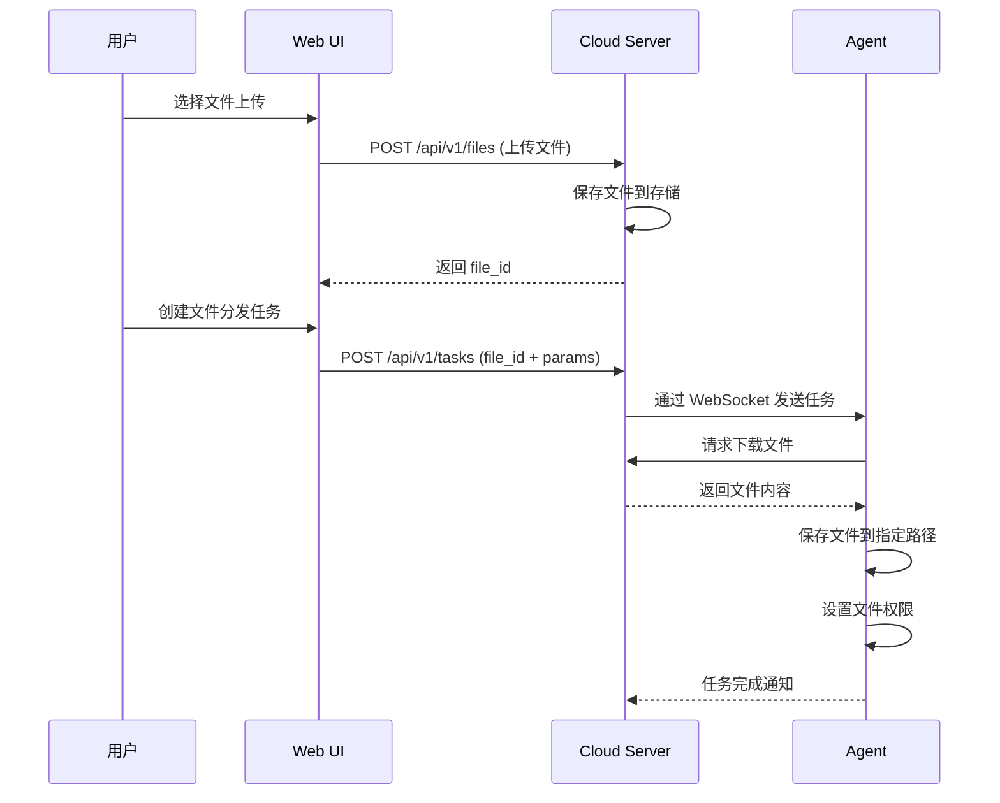

# 文件操作插件使用指南

## 概述

文件操作插件提供文件的上传、下载、复制、删除等操作功能。支持文件分发到多个 Agent 节点。

## 任务类型

`file`

## 功能特性

- ✅ 文件上传到 Agent
- ✅ 文件复制和移动
- ✅ 文件删除
- ✅ 目录创建
- ✅ 文件权限设置
- ✅ 批量文件分发

## 参数说明

### 基本参数

| 参数名 | 类型 | 必填 | 说明 |
|--------|------|------|------|
| `file_id` | string | 是 | 上传到 Cloud 的文件 ID |
| `params` | object | 否 | 操作参数 |

### params 对象结构

| 参数名 | 类型 | 默认值 | 说明 |
|--------|------|--------|------|
| `file_path` | string | - | 目标文件路径 |
| `mode` | string | 0644 | 文件权限（八进制） |
| `owner` | string | - | 文件所有者 |
| `group` | string | - | 文件所属组 |

## 配置示例

### agent-plugins.yaml

```yaml
plugins:
  - type: file
    enabled: true
    config:
      base_path: /tmp/cloud-agent  # 文件存储基础路径
      max_file_size: 104857600     # 最大文件大小（100MB）
```

## 使用示例

### 示例 1: 上传单个文件

**步骤：**
1. 在 UI 中选择任务类型为"传递文件"
2. 上传文件（例如：deploy.sh）
3. 选择目标 Agent
4. 填写参数：

```json
{
  "file_path": "/opt/scripts/deploy.sh",
  "mode": "0755"
}
```

### 示例 2: 批量上传文件

**步骤：**
1. 选择任务类型为"传递文件"
2. 上传多个文件（最多 50 个）
3. 选择多个目标 Agent
4. 系统会自动为每个文件创建分发任务

### 示例 3: 上传配置文件

**参数：**
```json
{
  "file_path": "/etc/app/config.yaml",
  "mode": "0644",
  "owner": "app",
  "group": "app"
}
```

### 示例 4: 上传可执行文件

**参数：**
```json
{
  "file_path": "/usr/local/bin/myapp",
  "mode": "0755",
  "owner": "root",
  "group": "root"
}
```

### 示例 5: 上传到临时目录

**参数：**
```json
{
  "file_path": "/tmp/data.json",
  "mode": "0644"
}
```

## 文件上传流程



## 文件权限说明

### 权限模式

使用八进制表示文件权限：

| 权限 | 数值 | 说明 |
|------|------|------|
| `0644` | rw-r--r-- | 所有者可读写，其他人只读 |
| `0755` | rwxr-xr-x | 所有者可读写执行，其他人可读执行 |
| `0600` | rw------- | 仅所有者可读写 |
| `0700` | rwx------ | 仅所有者可读写执行 |
| `0666` | rw-rw-rw- | 所有人可读写 |
| `0777` | rwxrwxrwx | 所有人可读写执行（不推荐） |

### 示例

```json
{
  "file_path": "/etc/app/secret.key",
  "mode": "0600",  // 仅所有者可读写
  "owner": "app",
  "group": "app"
}
```

## 常见问题

### 1. 文件上传失败

**错误信息：**
```
Error: failed to upload file: file size exceeds limit
```

**解决方案：**
- 检查文件大小是否超过限制（默认 100MB）
- 调整 `max_file_size` 配置
- 考虑压缩文件后上传

### 2. 权限不足

**错误信息：**
```
Error: failed to save file: permission denied
```

**解决方案：**
- 检查 Agent 进程的运行用户权限
- 确保目标目录存在且可写
- 使用具有足够权限的用户运行 Agent

### 3. 目录不存在

**错误信息：**
```
Error: failed to save file: no such file or directory
```

**解决方案：**
- 先创建目标目录
- 或者在 Shell 任务中先执行 `mkdir -p /path/to/dir`

### 4. 文件已存在

**行为：**
- 默认会覆盖已存在的文件

**注意：**
- 重要文件建议先备份
- 或者使用不同的文件名

## 最佳实践

### 1. 使用合适的文件权限

```json
{
  "file_path": "/etc/app/config.yaml",
  "mode": "0644"  // 配置文件
}
```

```json
{
  "file_path": "/usr/local/bin/app",
  "mode": "0755"  // 可执行文件
}
```

```json
{
  "file_path": "/etc/app/secret.key",
  "mode": "0600"  // 密钥文件
}
```

### 2. 设置文件所有者

```json
{
  "file_path": "/opt/app/data.json",
  "mode": "0644",
  "owner": "app",
  "group": "app"
}
```

### 3. 批量分发配置文件

1. 准备配置文件（例如：nginx.conf）
2. 上传到 Cloud
3. 选择所有需要更新配置的 Agent
4. 一键分发

### 4. 配合 Shell 任务使用

**步骤 1：上传文件**
```json
{
  "type": "file",
  "file_id": "file-abc123",
  "params": {
    "file_path": "/tmp/deploy.sh",
    "mode": "0755"
  }
}
```

**步骤 2：执行脚本**
```json
{
  "type": "shell",
  "command": "/tmp/deploy.sh"
}
```

### 5. 上传压缩包并解压

**步骤 1：上传压缩包**
```json
{
  "type": "file",
  "file_id": "file-xyz789",
  "params": {
    "file_path": "/tmp/app.tar.gz",
    "mode": "0644"
  }
}
```

**步骤 2：解压**
```json
{
  "type": "shell",
  "command": "tar -xzf /tmp/app.tar.gz -C /opt/app && rm /tmp/app.tar.gz"
}
```

## 安全建议

1. **限制文件路径**：
   - 配置 `base_path` 限制文件存储位置
   - 避免上传到系统关键目录

2. **文件权限控制**：
   - 敏感文件使用 `0600` 权限
   - 可执行文件使用 `0755` 权限
   - 避免使用 `0777` 权限

3. **文件大小限制**：
   - 设置合理的 `max_file_size`
   - 大文件考虑使用外部存储

4. **文件类型验证**：
   - 上传前验证文件类型
   - 避免上传恶意文件

## 相关文档

- [开发指南](../5-开发指南.md)
- [API 文档](../3-API文档.md)
